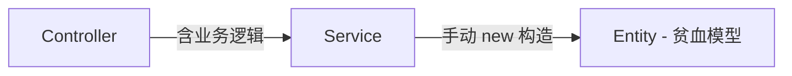

# 技术规格：实体充血模型与控制器业务逻辑剥离

## 1. 问题描述

当前代码库存在架构分层不清晰的问题：

1. **Controller 包含业务逻辑**：多个 Controller 中存在实体存在性检查、业务规则判断（如系统角色不可删除）等代码，这些应属于 Service 层的职责。
2. **Service 手动构造实体**：Service 的 Create 方法使用 `new Entity { ... }` 逐属性赋值，实体仅作为数据容器（贫血模型），而非封装业务行为的充血模型。
3. **规范缺失**：CLAUDE.md 未明确记录 Controller 职责边界和充血模型规范。

## 2. 相关代码

### Controller 层（需剥离业务逻辑）

| 文件 | 问题代码 |
|---|---|
| `src/.../Controllers/SysRoleController.cs:74-80` | `Delete` 中检查 `role.IsSystem` |
| `src/.../Controllers/SysRoleController.cs:39-41` | `GetById` 中检查 `role == null` |
| `src/.../Controllers/SysPermissionController.cs:58-64` | `Delete` 中处理 `permission == null` 和子节点错误 |
| `src/.../Controllers/SysPermissionController.cs:33-35` | `GetById` 中检查 `permission == null` |
| `src/.../Controllers/SysUserRoleController.cs:28-40` | `Bind` 中检查 user/role 是否存在 |
| `src/.../Controllers/SysUserRoleController.cs:61-63` | `GetRolesByUserId` 中检查 user 是否存在 |
| `src/.../Controllers/SysUserRoleController.cs:75-77` | `GetUsersByRoleId` 中检查 role 是否存在 |

### Service 层（需引入充血模型）

| 文件 | 问题代码 |
|---|---|
| `src/.../Services/SysUser/SysUserService.cs:38-46` | `Create` 中手动构造 `new SysUser {}` |
| `src/.../Services/SysRole/SysRoleService.cs:36-44` | `Create` 中手动构造 `new SysRole {}` |
| `src/.../Services/SysPermission/SysPermissionService.cs:26-37` | `Create` 中手动构造 `new SysPermission {}` |
| `src/.../Services/SysUserRole/SysUserRoleService.cs:29-33` | `Bind` 中手动构造 `new SysUserRole {}` |

### Entity 层（需添加工厂方法）

| 文件 | 需添加的方法 |
|---|---|
| `src/.../Model/Entities/SysUser.cs` | `static SysUser CreateFrom(CreateUserRequest)` |
| `src/.../Model/Entities/SysRole.cs` | `static SysRole CreateFrom(CreateRoleRequest)` |
| `src/.../Model/Entities/SysPermission.cs` | `static SysPermission CreateFrom(CreatePermissionRequest)` |
| `src/.../Model/Entities/SysUserRole.cs` | `static SysUserRole CreateRelation(long userId, long roleId)` |

### 其他

| 文件 | 说明 |
|---|---|
| `CLAUDE.md` | 需追加中文架构规范 |
| `src/.../Services/SysUserRole/SysUserRoleService.cs` | `Bind` 中需添加 user/role 存在性校验 |

## 3. 当前状态



- Controller 承担了本不属于自己的业务校验职责
- Entity 是纯数据对象（贫血模型），没有业务行为
- Service 承担了实体构造职责，与 DDD 分层原则不符

## 4. 变更方案

### 4.1 Controller 业务逻辑下沉

原则：**Controller 只做三件事** — 解析 HTTP 参数、调用 Service、返回统一响应。所有 `if-else` 业务判断迁移到 Service 层。

**SysRoleController 变更：**
- `GetById`：移除 `role == null` 检查，改为由 Service 返回 null 时 Controller 直接返回 404
- `Delete`：移除 `role.IsSystem` 检查，下沉到 SysRoleService.Delete 中处理

**SysPermissionController 变更：**
- `GetById`：移除 `permission == null` 检查
- `Delete`：移除 null 检查和子节点错误处理，全权交给 SysPermissionService

**SysUserRoleController 变更：**
- `Bind`：移除 user/role 存在性检查改为由 SysUserRoleService 内部校验（需注入 userRepository 和 roleRepository）
- `GetRolesByUserId`：移除 user 存在性检查
- `GetUsersByRoleId`：移除 role 存在性检查

### 4.2 实体充血模型

**模式**：为每个实体添加静态工厂方法，封装 DTO → 实体的转换逻辑。

```csharp
// SysUser 示例
public static SysUser CreateFrom(CreateUserRequest request)
{
    return new SysUser
    {
        Id = 0,
        Nickname = request.Nickname,
        RealName = request.RealName,
        Gender = request.Gender,
        BirthDate = request.BirthDate,
        CreatedTime = DateTime.Now
    };
}
```

**优点：**
- 实体构造逻辑集中管理，一处变更全局生效
- Service 只关心业务编排，不关心实体属性映射
- 便于单元测试——实体构造逻辑可独立测试

**注意事项：**
- Entity 项目（Model）需要引用对应的 DTO 命名空间，或使用 DTO 所在的 Model 内部命名空间
- DTO 类（`CreateUserRequest` 等）位于 `Model/Dtos/` 下，与 `Model/Entities/` 同属一个项目，可以直接引用

### 4.3 SysUserRoleService 增强

`SysUserRoleService.Bind` 当前只检查了绑定关系是否已存在，未校验 user 和 role 是否真实存在。需注入 `IBaseRepository<SysUser>` 和 `IBaseRepository<SysRole>` 并添加存在性校验。

当前构造函数已有这两个 repository 注入：
```csharp
public class SysUserRoleService(
    IBaseRepository<SysUserRole> repository,
    IBaseRepository<SysRole> roleRepository,
    IBaseRepository<SysUser> userRepository
) : BaseServices<SysUserRole>(repository), ISysUserRoleService
```

所以只需在 `Bind` 方法中添加存在性检查即可。

### 4.4 CLAUDE.md 更新

在 CLAUDE.md 末尾（`Key Patterns` 区域后或新章节）追加以下中文规则：

**规则 1 — Controller 职责边界：**
Controller 仅负责 HTTP 请求处理，不得包含业务逻辑判断。所有业务校验（存在性检查、权限判断、状态转换约束等）必须在 Service 层完成。

**规则 2 — 实体充血模型：**
实体应封装业务行为。Create 场景中使用静态工厂方法（如 `Entity.CreateFrom(dto)`）构造实体，禁止在 Service 中通过 `new Entity { ... }` 手动逐属性赋值。

### 4.5 变更顺序

```
1. Entity 层：添加静态工厂方法（无风险，纯新增）
2. Service 层： 
   a. SysRoleService.Delete 添加 IsSystem 检查
   b. SysPermissionService.Delete 已含有子节点检查（保留不变）
   c. SysUserRoleService.Bind 添加 user/role 存在性校验
3. Controller 层：移除业务逻辑，改为纯 HTTP 编排
4. CLAUDE.md：追加规范
```

## 5. 端到端流程

以"删除角色"为例，重构后的调用链：

```
HTTP DELETE /role/{id}
  → SysRoleController.Delete(id)
    → SysRoleService.Delete(id)       // 内含 IsSystem 检查和删除逻辑
      → base.GetById(id)              // 若 role == null，直接返回 false
        → role.IsSystem → 返回 false
      → base.DeleteById(id)
    → Controller 根据 bool 返回成功/失败响应
```

以"创建用户"为例，重构后的调用链：

```
HTTP POST /SysUser
  → SysUserController.Create(CreateUserRequest)
    → SysUserService.Create(request)
      → SysUser.CreateFrom(request)   // 实体工厂方法构造
      → base.Insert(user)
    → Controller 返回成功响应
```

## 6. 风险与缓解

| 风险 | 缓解措施 |
|---|---|
| 行为变更：将校验移到 Service 后返回方式不同 | Controller 原本返回 `ApiResponse.Fail`，Service 返回 `bool/CreateUserResponse?`。重构后保持相同的 HTTP 状态码和错误消息 |
| SysUserRoleController 的 Bind 方法需增强 | 当前已有 roleRepository 和 userRepository 注入，仅需新增存在性检查 |
| 实体工厂方法增加 DTO 耦合 | Entity 和 DTO 同属 Model 项目，无跨项目依赖问题 |
| 回归风险 | 所有变更均为纯重构（提取 + 移动），不改变业务逻辑 |

## 7. 测试与验证

### 单元测试

| 测试类 | 测试用例 |
|---|---|
| **SysUserServiceTests** | `Create_WithValidRequest_ReturnsCreatedUser`、`Create_WithExistingNickname_ReturnsNull` |
| **SysRoleServiceTests** | `Delete_WithSystemRole_ReturnsFalse`、`Delete_WithNonExistentRole_ReturnsFalse`、`Delete_WithNormalRole_DeletesSuccessfully` |
| **SysPermissionServiceTests** | `Delete_WithChildren_ReturnsFalse`、`Delete_WithoutChildren_DeletesSuccessfully` |
| **SysUserRoleServiceTests** | `Bind_WithNonExistentUser_ReturnsFalse`、`Bind_WithNonExistentRole_ReturnsFalse`、`Bind_WithExistingRelation_ReturnsFalse` |
| **SysUserTests** | `CreateFrom_WithValidRequest_SetsAllProperties` |

### 集成验证

- `dotnet build` 通过
- `dotnet test` 全部通过
- 所有 API 端点手动调用，响应与重构前一致

### 代码审查

- Controller 文件：不应出现 `if-else` 业务判断（仅保留 API 响应格式判断如 `result == null` 转 `Fail`）
- Entity 文件：应存在 `CreateFrom` 等业务方法
- CLAUDE.md：包含中文规范

## 8. 后续事项

- CI 流程中可考虑添加架构规则检查（如 ArchUnit 或自定义分析器）
- 后续可考虑将校验逻辑从 Service 进一步下沉到 Entity（如 `SysUser.CanDelete()`）
